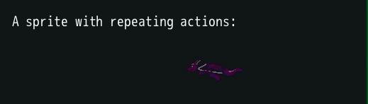

# Zif: A Drop-in Framework for DragonRuby GTK

Zif is a collection of features commonly required in 2D games.  The name is a reference to [Zero Insertion Force connectors used on the original Nintendo](https://console5.com/wiki/Improving_NES-001_Reliability) - You can drop it in your project and it should just work.  Everything is namespaced to `Zif` so any existing classes or namespaces you have should be preserved.

## Example App
This repo is an example app - the `Zif` library is entirely contained within the `app/lib` directory.


### Running the Example App:
1. Create a fresh copy of DragonRuby GTK - you can call this folder `dragonruby-zif-testbed` and it should contain the `dragonruby` executable.
2. Change directory in your terminal to `dragonruby-zif-testbed`
3. Clone this entire `dragonruby-zif` repo inside the `dragonruby-zif-testbed` directory - `git clone https://github.com/danhealy/dragonruby-zif.git`.
4. Run using `./dragonruby dragonruby-zif/`

## Installation in your app:
1. Create a `lib` directory inside the `app` directory, and then copy the `app/lib/zif` directory into it.
2. In your `main.rb`, require the parts of Zif you need.  To require everything:

```ruby
# Require all of the Zif library:
require 'app/lib/zif/require.rb'

def tick
  # ....
end
```

If you only want to require some parts, please see the `require.rb` file for more information.

# Features
## Module
### Zif
The `Zif` module itself has a collection of frequently used helpers, like `Zif.sub_positions` for subtracting one array with two elements (e.g. `[x, y]`) from another.
- `.boomerang(i, max)`: returns `i` if it's under `max`, or `max - (i - max)` otherwise, clamped to `0`
- `.add_positions(a, b)` adds two 2-element arrays together.  `[10, 20] + [3, 4] = [13, 24]`
- `.sub_positions(a, b)` subtracts two 2-element arrays together.  `[10, 20] + [3, 4] = [7, 16]`
- `.position_math(op, a, b)` arbitrary operation on two 2-element arrays. Will `send` `op` to `a` elements with `b` elements as arguments.  `.position_math(:plus, a, b)` is equivalent to `.add_positions(a, b)`
- `.relative_rand(x)` returns a random integer around `0` to a magnitude of `x/2`.
- `.rand_rgb(base, max)` returns a random 3-element array of integers of at least `base` and at most `max`
- `.hsv_to_rgb(h, s, v)` expects hues 0-359, saturation and value 0-100 and returns a 3-element array of integers representing the red, green and blue values.
- `.distance(x1, y1, x2, y2)` implements the distance formula.
- `.radian_angle_between_points(x1, y1, x2, y2)`
- `.roll(given_dice)` expects `given_dice` to be a hash `{dice: X, sides: Y, modifier: Z}`.  Rolls `X` dice of `Y` sides each and adds `Z` to the total.
- `.roll_raw(die, sides)` rolls `die` dice of `sides` sides and returns the total.

Some methods will expect array arguments and others expect individual elements (`add_positions` vs `distance`), remember that you can splat arrays:  `.distance(*a, *b)` works if `a` and `b` are 2-element arrays.


## Mixins
These modules are designed to be included in another class.
- **`Zif::Serializable`**: Works with any class.  Automatically defines `#serialize` `#to_s` and `#inspect` based on the instance variables defined on the class. As you will encounter using DRGTK, if these methods are defined, DRGTK will use them to automatically print info to the console when exceptions occur.
- **`Zif::Actionable`**:  Works with any class.  Defines the required attributes & methods to allow this class to be used with the `ActionService`, namely `#run`, `#new_action`, `#stop_action` etc
- **`Zif::Assignable`**: Works with classes which implement sprite attributes (`Zif::Sprite` or any class with `attr_sprite`).  Allows you to `#assign` sprite attributes to the object with a hash, e.g. `obj.assign({x: 10, y: 10, w: 32...`
- **`Zif::Animatable`**: Works with classes which implement `#path` and `#path=`.  Helpers for generating `Sequence`s which change the `path` over time (animations).
- **`Zif::Traceable`**: Works with any class but expects `$services`.  Allows you to set a variable `@tracer_service_name` to the registered name of the `Zif::TickTraceService`, and afterwards you can simply use `#mark` to mark a section of code in this class for performance tracing.

## Basic Classes

### Zif::Sprite
This class is the basis for most of the framework.  It's a class which uses [`attr_sprite`](https://github.com/DragonRuby/dragonruby-game-toolkit-contrib/blob/master/dragon/attr_sprite.rb) and defines some basic helper methods: `#xy` returns an array `[@x, @y]`, and so on.  Includes all the mixins described above.

**Example usage**:
```ruby
@dragon = Zif::Sprite.new.tap do |s|
  s.x = 300
  s.y = 300
  s.w = 100
  s.h = 80
  s.path = "sprites/dragon_0.png"
end
```

You can give Sprites a `name` - this is used directly by `Zif::SpriteRegistry`, etc.

A `Zif::Sprite` has attribtues for `logical_x/y`.  These can be used to assign a position to the sprite independent of the pixel size.  For example, `Zif::TiledLayer` uses these attributes to position a tile relative to other tiles, independently of tile pixel size.

It has a `z` attribute, `on_mouse_[down/changed/up]` attributes, and it implements `#clicked?` - These are used by the `Zif::InputService`.

To support `Zif::RenderTarget`, a `render_target` attribute is set on a Sprite which is a "containing sprite" for a render target (meaning the `path` is assigned to a `RenderTarget` name).

### Zif::CompoundSprite
This class acts like a (inherits from) `Sprite` but can itself accept a list of `@sprites` and `@labels`, like `$gtk.args.outputs`.  Sprites and labels added to these arrays will be drawn using the `CompoundSprite#draw_override` method, which is checked by DragonRuby GTK during the draw cycle.

The `CompoundSprite` itself is not drawn directly, per se (`@path` is ignored), but has `x`/`y`/`w`/`h`/`source_x`/`source_y`/`source_w`/`source_h` values which act as modifiers to the `@sprites` it is drawing.
A sprite which has been added to a `CompoundSprite`'s `@sprites` array will be drawn in the following way:
- The `CompoundSprite`'s `x`/`y`/`w`/`h` act as a viewable rectangle on the main screen and are absolute values compared to the game resolution.  Sprites which would be drawn completely outside of this rect will be ignored.  **Important!** This is unlike Render Targets or regular sprites, which cut off the image cleanly at these boundaries.  The `CompoundSprite` is a virtual effect which can't slice a sprite in half.  Therefore, the entire sprite is rendered if even a portion is visible in the viewable rect.
- The `CompoundSprite`'s `source_x`/`source_y`/`source_w`/`source_h` act like these attributes would if displaying a normal image instead of a collection of sprites.  They are relative values of the `@sprites` it is drawing.
  - `source_x`/`source_y` reposition the origin of the viewport into the `@sprites` array.  E.g. If you have a sprite @ 0x/0y with 10w/10h it will not be drawn if the `CompoundSprite`'s `source_x`/`source_y` exceeds 10/10
  - `source_w`/`source_h` describe the extent of the viewport into the `@sprites` array.  E.g. If the `CompoundSprite` has `0x`/`0y`/`20w`/`20h`/`0 source_x`/`0 source_y`/`10 source_w`/`10 source_h`, the example `0x`/`0y`/`10w`/`10h` sprite will be displayed twice as large as normal.
  - **Important!** As above, unlike a normal sprite, changing the `source_x`/`source_y`/`source_w`/`source_h` will not cause sprites drawn this way to be sliced in any way.  It will simply zoom and pan the complete sprites, and possibly ignore them if they exceed the extent of the viewable rectangle or the source viewport.

You can use `CompoundSprite` to draw several sprites which need to move together or relative to each other.  You can move the entire collection by changing the `CompoundSprite`'s `x` and `y` values, or you can move the component sprites relative to each other individually.

This class is the basis for `ActiveLayer` and many of the UI elements (TwoStageButton, ProgressBar, NinePanel, etc).


### Zif::RenderTarget

A render target is a way to programmatically create a sprite.  It acts just like `$gtk.args.outputs` in that it accepts an array of `sprites` and other `primitives`.  It gets rendered on the tick where its `width` and `height` are defined (allocated).  To display it, you need to create a sprite and reference the name of the render target as the `path`.

Render targets are great for increasing the performance of your game by rendering a large collection of sprites once, and then just reusing that render later. It's also good for displaying the same image composed of many sprites multiple times (think minimap or mirrors).

This class handles this for you: it accepts `sprites` `labels` and `primitives` arrays.  You can force it to `#redraw`.  It produces a `#containing_sprite` (a `Zif::Sprite`) which references itself as the `path` and sets the `source_*` attributes to match the `width` and `height`. You can use `#project_to` and `#project_from` to control panning and zooming of the containing sprite.  It can be used with the `InputService` as it responds to `#clicked?` - and passes the click down to the component sprites and primitives.

**Example usage**:
```ruby
paint_canvas = Zif::RenderTarget.new(:my_paint_canvas, :white, 1000, 500)
paint_canvas.sprites << @all_current_brushstrokes
paint_canvas.redraw
$gtk.args.outputs.static_sprites << paint_canvas.containing_sprite
```

Although an already rendered RenderTarget is cheap to display, one drawback of using RenderTargets is that they take a little longer to process in the first place, compared to simply drawing sprites the normal way.  This can become an issue if you need to frequently update the RenderTarget due to changes on the source sprites.  Say you have a large tile map you pregenerate as a RenderTarget when the game loads.  If you need to change a single tile, like if that tile represents a door and the door opens, normally you would need to regenerate the entire RenderTarget using all of the source sprites.

A technique the DragonRuby community (specifically Islacrusez, oeloeloel) has identified to overcome this performance issue is to build another RenderTarget using the previously rendered one, plus whatever sprites are changing.  See [this example implementation of this technique](https://github.com/oeloeloel/persistent-outputs).

There are two downsides to this technique:
- It's inherently an additive process, so erasing data is tricky.  Zif has chosen a simple approach where you may delete a single rectangle per redraw.
- Although `Zif::RenderTarget` keeps track of a single `@containing_sprite` which references it's `@name` (path), you are allowed to reuse that path in any number of other sprites this class might not know about.

This technique is built into `Zif::RenderTarget` using the `#redraw_from_buffer` method.  This method accepts three arguments:
- An array of sprites to be added to the new render target
- An optional `[x, y, width, height]` 4-element array rectangle to be used to remove data from the old render target (if you need to delete something, mitigating the first issue above.
- An optional array of sprites *besides the containing_sprite* which reference this RenderTarget's `@name` and therefore need to have their `@path` changed, mitigating the second issue above.

See the `DoubleBufferRenderTest` scene in the example app for a working example.

**Example usage**:
```ruby
# building on previous example

minimap = # ... a sprite referencing the RenderTarget
new_brushstroke = # ... a new Sprite
erase_rect = [200, 200, 10, 10] # Let's say you erased something, too

paint_canvas.redraw_from_buffer([new_brushstroke], erase_rect, [minimap])
```

### Zif::Action
Inspried by [SpriteKit's Actions](https://developer.apple.com/documentation/spritekit/skaction) and [Squirrel Eiserloh's GDC talk on nonlinear transformations](https://www.youtube.com/watch?v=mr5xkf6zSzk).
An `Action` is a transition of a set of attributes over time using an easing function (aka tweening, easing).  On `#initialize` you define:
- an object to perform the action on (generally done for you via `#new_action` on `Zif::Actionable`)
- a `finish` state which is a hash of attributes and their desired final values
- a `duration` in ticks
- the `easing` function to use (see `Zif::Action::EASING_FUNCS`)
- the rounding function to use (`Zif::Action::ROUNDING_FUNCS`)
- the number of times to repeat the action, either an integer value or `:forever`
- Finally, it accepts a block to be used as a callback when the action finishes.

An `Actionable` can have several `Action`s running simultaneously.

**Example usage:**
```ruby
# @dragon is a Zif::Sprite and therefore an Actionable
# Move from starting position to 1000x over 1 second, starting slowly, then flip the sprite at the end
@dragon.run(@dragon.new_action({x: 1000}, 1.seconds, :smooth_start) { @dragon.flip_horizontally = true })
```

### Zif::Sequence
A `Sequence` is a series of `Actions` to be run in order.

**Example usage:**

```ruby
# Run some action sequences on this sprite
@dragon.run(@dragon.fade_out_and_in_forever) # fade_out_and_in_forever is an example sequence, check out the source
@dragon.run(
  Zif::Sequence.new(
    [
      # Move from starting position to 1000x over 1 second, starting slowly, then flip the sprite at the end
      @dragon.new_action({x: 1000}, 1.seconds, :smooth_start) { @dragon.flip_horizontally = true },
      # Move from the new position (1000x) back to the start 600x over 2 seconds, stopping slowly, then flip again
      @dragon.new_action({x: 600}, 2.seconds, :smooth_stop) { @dragon.flip_horizontally = false }
    ],
    :forever
  )
)

# Register the flying animation by name.
# Tell it to use the 4 images 1 through 4, then reverse back to 1.
# Hold each image for 4 ticks.
@dragon.new_basic_animation(
  :fly,
  [1,2,3,4,3,2].map { |i| ["dragon_#{i}", 4] }
)

@dragon.run_animation_sequence(:fly)
```


### Zif::Scene
A `Scene` is a full-screen view of your game.  The concept in `Zif::Game` is to show one `Scene` at a time. So each `Scene` in your game should be a subclass of `Zif::Scene` which overrides `#perform_tick`. Using the structure in `Zif::Game`, `#perform_tick` comes after input handling and before updating `Actionable`s. So your subclass should use `#perform_tick` to add/remove clickables/`Actionable`s, and respond to any detected input. Switching scenes is handled in `Zif::Game`, based on the return value of `#perform_tick`.  You can optionally define `#prepare_scene` - a method invoked prior to the first tick it is the active scene, and `#unload_scene` which is invoked after the Scene has been switched.

### Zif::Game
This is designed to be the base class for your game.  It's mainly responsible for Scene switching and yielding to `Scene#perform_tick` as described above, but also it automatically registers all the `Zif` services and provides standard functionality around this, including exception handling.

**Example usage:** in `main.rb`
```ruby
class MyGame < Zif::Game
  def initialize
    super()
    MyOneTime.setups # do anything here, like register services...
    register_scene(:rainbow_road, RainbowRoadScene) # (RainbowRoadScene is a Zif::Scene subclass)
    @scene = OpeningScene.new # (this is a Zif::Scene subclass)
  end
end

def tick(args)
  if args.tick_count == 2 # Some things can't be initialized in DR on the first tick.
    $game = MyGame.new
    $game.scene.prepare_scene # if needed on first scene
  end

  $game&.perform_tick
end
```

## Classes for 2D Scrolling Games
If your game's play area extends beyond the screen resolution, you likely want some way of managing this!  These classes are designed for this use case.

### Zif::LayeredTileMap

Creates a set of overlapping play area layers and handles redrawing them.

Has a concept of "logical" position as a multiple of "tile" width/height. (For example, if your tiles are `16px` wide, the 4th tile is at `@logical_x==4` but `@x==64`)

As an example, you can have a "tiles" layer which gets redrawn only at the start of the game, an "interactive
objects" layer which gets redrawn whenever objects appear or disappear, and then an "avatar" layer which gets
redrawn every time the avatar moves.  The advantage of using RenderTargets here is to keep the positioning
consistent across all of the layers.  You can just pass all of the RT containing sprites to `Zif::Camera` and it will
pan them all in unison.

You setup and configure these layers via `#new_simple_layer` and `#new_tiled_layer`.

Performance notes:
 - Since the memory requirements here are based on the number of layers * area of each layer, consider other
   approaches if you have a lot of layers with few sprites in them (maybe use sprites directly but with more math to
   keep positions in sync)
 - It is *expensive* to redraw a RT with thousands of sprites.  Consider - 1280x720 / 16x16 -> 80*45 = 3600 tiles.
   Of course it's more expensive to draw these every tick (not using render_target), but you will see noticable
   hiccups if you do this often.  Try not to redraw RTs with lots of sprites while action is happening.
  - You can use the RenderTarget's `#redraw_from_buffer` strategy indirectly by setting the `@rerender_rect` attribute.  If this attribute is set when the layer is redrawn, it'll remove that rect from the last rendered version of the layer and redraw any sprites which intersect that rect.

**Example usage**:
```ruby
map_layer_render_target_prefix = "map"
tile_width_and_height = 64 # pixels
map_width_and_height_in_tiles = 100 # 64 * 100 = 6400x6400 pixels

@map = Zif::LayeredTileMap.new(
  map_layer_render_target_prefix,
  tile_width_and_height,
  tile_width_and_height,
  map_width_and_height_in_tiles,
  map_width_and_height_in_tiles
)
@map.new_tiled_layer(:tiles)
@map.new_simple_layer(:avatar)
@map.force_refresh # Force it to set up the render targets for the first time

# The should_render attribute will be checked each tick to decide if the RT should render
@map.layers[:avatar].should_render = true
@map.layers[:avatar].source_sprites = [@dragon]

# ----
# Add a bunch of tiles over a few ticks
a_new_tile = Zif::Sprite.new....
@map.add_positioned_sprite(x, y, a_new_tile)
# ----

# When all the tiles have been added
@map.layers[:tiles].should_render = true

@camera = Zif::Camera.new(
  @map.target_name,
  @map.layer_containing_sprites,
  Zif::Camera::DEFAULT_SCREEN_WIDTH,
  Zif::Camera::DEFAULT_SCREEN_HEIGHT,
  1800,
  1200
)

@map.refresh
@map.layers[:tiles].should_render = false # Really just want to render the tiles once.

$gtk.args.outputs.static_sprites << @camera.layers
```

### Zif::SimpleLayer

Designed to be used with `Zif::LayeredTileMap`, this is an extension of `RenderTarget` where `source_sprites` is a simple flat array.  Uses natural x/y positioning, and `visible_sprites` is a simple `select` of sprites which `intersect_rect?`.

Defines the `#redraw_from_buffer` method described above.

### Zif::ActiveLayer
Acts like `SimpleLayer` but is implemented using `CompoundSprite` instead of `RenderTarget`.  The `source_sprites` will be drawn on **every** tick, so use this for layers which have low sprite counts but which need to be redrawn frequently (like the player character).

### Zif::TiledLayer
A subclass of `SimpleLayer`, this redefines `source_sprites` as a 2-dimensional array, indexed by logical (tile) position.

### Zif::BitmaskedTiledLayer
A TiledLayer where the sprites are chosen via bitmasked adjacency rules on the presence data layer - otherwise known as Autotiling.  This class expects that you've registered your autotile images using a `SpriteRegistry` available at `$services[:sprite_registry]`.  See `Zif::SpriteRegistry#register_autotiles`

### Zif::Camera
Designed to work with `Zif::LayeredTileMap`, the Camera is initialized with a set of layer sprites, typically these are the `containing_sprite`s of large render targets. It zooms these sprites to fit the viewable area of the screen. It is responsible for directing the layers to reposition based on camera movements.

The Camera is an example of an `Actionable` class which isn't a `Sprite`.  It defines `#pos_x` and `#pos_x=` methods to act like a single accessor for each layer's `source_x` values.  In this way, we can ease the panning of all the layers by creating an `Action` for a final `pos_x` value.

**Example usage:** (also see usage under `Zif::LayeredTileMap`)
```ruby
@camera.start_following(@dragon) if @dragon.walking
```

This implements `#scrolled?` and interprets it as a directive to zoom the layer sprites.  A zoom factor of `1.0` indicates the native screen size, you can retrieve this with `#zoom_unit`.  Min and max zoom factor are controlled by `@max_zoom_in`/`@max_zoom_out`.  By default, it will center the zoom at the last followed location `@last_follow` or the center of the screen.

`#translate_pos(given)` translates a point in the window with the corresponding point on the map layers, by considering the zoom factor and current viewport.

**TODO:** Camera could be extended to support parallax effects...

## Panels, Components, Labels
These are classes which help create UI elements.  TODO: More documentation.

## Services
Services are game features which can be accessed from any context within your game.  If you use `Zif::Game`, each service will be registered in the `Game`'s ivar `@services` by a symbol, e.g. `@services.register(:action_service, Zif::ActionService.new)` is run during initialization and thereafter you can access the `ActionService` by `game.services[:action_service]`.  Additionally by convention, both `$game` and `$services` are available as global variables.

### Zif::ActionService
Register your sprite as something to check for running `Action`s by using `#register_actionable`.  Call `#run_all_actions` once per tick (handled by `Zif::Game` automatically), which will invoke `#perform_actions` on each registered `@actionable`.

### Zif::InputService
On each tick, `#process_click` should be run, which will detect clicks and pass them on to each sprite which has been registered via `#register_clickable`.  It expects each clickable object to define a `#clicked?(point, kind)` method.  If the sprite decides it has been clicked, it should return itself from this method.  Clicks are passed through to sprites based on their `z` value - if this value is nil, the service considers it to be at the bottom.  If the argument `absorb_click` is true, it directs the service to stop bubbling the click through any other clickables lower in the `z` order.

`Zif::Sprite` defines `#clicked?` and a set of ivars which are expected to contain callback lambdas: `@on_mouse_down, @on_mouse_up, @on_mouse_changed`.  These callbacks will receive as arguments the `sprite` itself and the location of the mouse in `point`.  If it can't handle the click but it knows it is the `containing_sprite` for a `Zif::RenderTarget`, it passes the click through.

`Zif::RenderTarget` also defines `#clicked?`, and passes clicks down to the component `@sprites` and `@primitives` of the render target.

`Zif::SimpleLayer` defines `#clicked?` and uses its `#visible_sprites` method to decide which component `@source_sprites` need to be checked for clicks.

`#register_scrollable`, is analogous to `#register_clickable` but for the scroll wheel. `#scrolled?` is expected to be defined, and it receives the mouse point and the direction of scrolling as arguments.  Only `Zif::Camera` defines `#scrolled?` out of the box.


### Zif::SpriteRegistry
This service allows you to register prototypes of assets as `Zif::Sprites`.

**Example usage:**

The following code will create a `Zif::Sprite` with w/h of 82px and 66px, referencing a `path` of `sprites/dragon_1.png`.  The second line demonstrates getting a fresh `Zif::Sprite` copy with these settings.
```ruby
$services[:sprite_registry].register_basic_sprite("dragon_1", 82, 66)
@dragon = $services[:sprite_registry].construct("dragon_1")
```

`#register_basic_sprite` accepts a block: this is a convenience, it sets the block to the constructed `Sprite`'s `@on_mouse_up` callback.

You can setup an alias for a registered sprite by using `#alias_sprite`

You can automatically register images used for autotiling / `Zif::BitmaskedTiledLayer` using the `#register_autotiles` method.  See the comments at `Zif::BitmaskedTiledLayer` and `Zif::SpriteRegistry#register_autotiles`.

### Zif::TickTraceService
Generally, you want your game to run at a full 60fps.  If your tick takes longer than 16.6ms, you'll drop below that number.  The TickTrace service is designed to report when a tick has taken longer than a threshold (20ms by default), and hopefully narrow down the slowest section of code. `#reset_tick` must be called at the beginning of a tick, and then `#finish` at the end.  If you use `Zif::Game`, this is done for you, all you need to do is `include Traceable` in any class you want to mark, set the `@tracer_service_name` ivar to `:tracer`, and then `mark('a section of code')`.  Since backtraces are not supplied in DRGTK, the best it can do is tell you the name of the class it was invoked in.  By convention, you should include the name of the method which calls `#mark`:  `mark('#my_method: a section of code')`

`#mark_and_print` is also available, if you want to print to the console when you mark the section.

**Example output:**

You should see some output like this when running the `World` example scene.  The first tick which renders the tile layer actually takes a long time.
```
================================================================================
Zif::TickTraceService: Slow tick.  59.609ms elapsed >  20.000ms threshold, longest step 'Zif::LayeredTileMap: #refresh: Rerendering tiles at [1800, 1200, 1280, 720]'  29.817ms:
       mark     delta label
    0.010ms   0.010ms ZifExample: #standard_tick: begin
    0.059ms   0.049ms ZifExample: #standard_tick: Scene #perform_tick complete
   29.876ms  29.817ms Zif::LayeredTileMap: #refresh: Rerendering tiles at [1800, 1200, 1280, 720]
   59.079ms  29.203ms Zif::LayeredTileMap: #refresh: Rerendered tiles
   59.098ms   0.019ms Zif::LayeredTileMap: #refresh: Rerendering stuff at [1800, 1200, 1280, 720]
   59.484ms   0.386ms Zif::LayeredTileMap: #refresh: Rerendered stuff
   59.496ms   0.012ms Zif::LayeredTileMap: #refresh: Rerendering avatar at [1800, 1200, 1280, 720]
   59.517ms   0.021ms Zif::LayeredTileMap: #refresh: Rerendered avatar
   59.528ms   0.011ms Zif::LayeredTileMap: #refresh: Rerendering top_effects at [1800, 1200, 1280, 720]
   59.539ms   0.011ms Zif::LayeredTileMap: #refresh: Rerendered top_effects
   59.545ms   0.006ms Zif::LayeredTileMap: #refresh: Rerendered all layers
   59.582ms   0.037ms ZifExample: #standard_tick: Scene switching handled
   59.609ms   0.027ms ZifExample: #standard_tick: end
```
